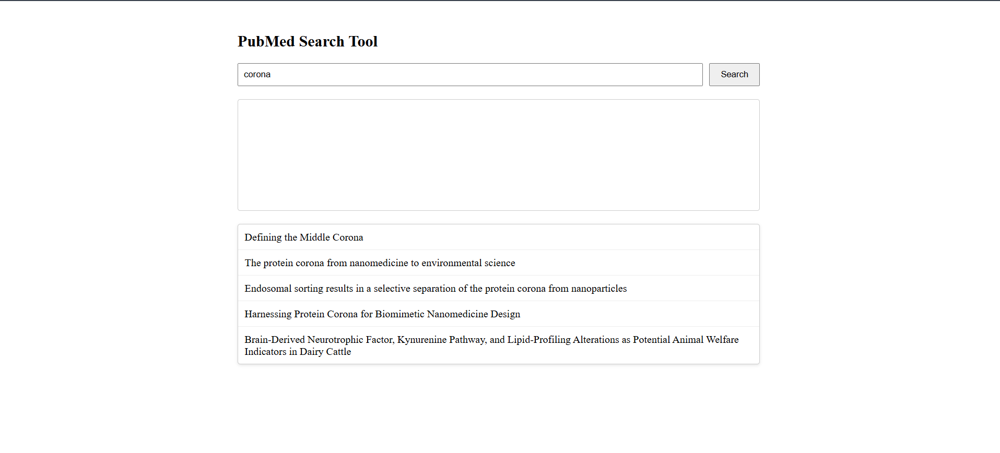
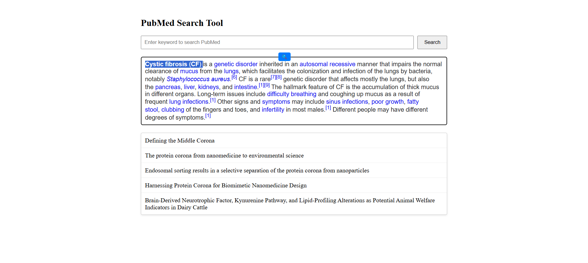
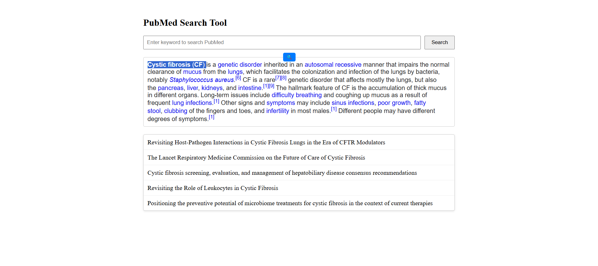

# 🔬 PubMed Search Tool

This React-based tool allows users to search PubMed articles either by manually entering keywords or by selecting text directly from a rich text editor. Results are fetched from a backend API and displayed interactively.

---

## 🚀 Features

- 🔍 Search PubMed articles by keyword input.
- ✍️ Select text within a content-editable editor to instantly search.
- 📌 Popup search icon appears near selected text.
- 📄 Top 5 search results displayed with clickable links to original sources.
- 📦 Clean and modular code with a separate CSS file.

---

## 🛠️ Tech Stack

- **React** – Frontend framework
- **Fetch API** – For making API calls to the backend
- **HTML DOMParser** – To extract results from PubMed HTML response
- **CSS** – Separated for styling and better maintainability

---

# 🧪 Usage
Type a keyword in the search bar and hit "Search" to query PubMed.

Alternatively, type or paste text in the editor, highlight a word/phrase, and click the search icon that appears to trigger a contextual search.

Click on a result to open the full article on PubMed.

# 📌 Notes
You’ll need a backend proxy API running to fetch PubMed search results (PubMed doesn’t offer direct open CORS access).

Modify fetch() URL in SearchBarWithEditor.js if your API path is different.


## ⚙️ Installation

1. **Clone the repository:**
   ```bash
   git clone https://github.com/yourusername/pubmed-search-tool.git
   cd pudmed


Run the Development Environment
# Start the server:

- cd server
- node server.js

# Start the client:

- cd ../client
- npm start

# Search result for keyword corona

# Text select 

# Result for selected text
